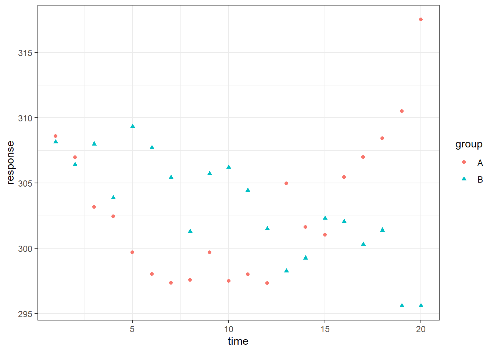
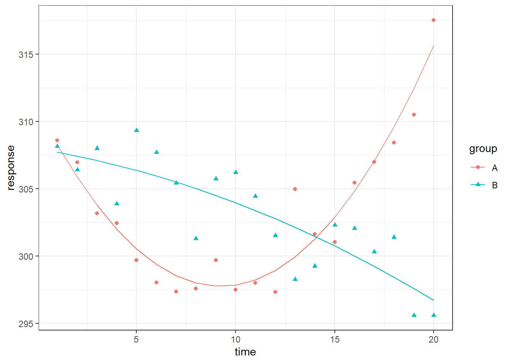

# Modeling trends

## Resources

[Slides](slides/04_trends/index.html)

## Activity

### Testing for a difference in time-varying pattern across two groups

:::{.try}

For the (made up) data below, you have longitudinal data for two groups, A and B, both of which show a quadratic trend over time. The data are in the R binary file [quadratic.rds](data/quadratic.rds){target="_download"}.




Once you have downloaded the file and put it in your working directory, you can load the data using:


```r
library("tidyverse")

qdata <- readRDS("quadratic.rds")
```

**Your task**: Using a single model, fit quadradic functions for both of the groups, with orthogonal polynomials.

If you need help adding polynomial predictors to your data frame, check out the function [`poly_add_columns()`](https://rdrr.io/github/tjmahr/polypoly/man/poly_add_columns.html) from the **`polypoly`** R package (install it using `install.packages("polypoly")`).

Note: You'll probably want to deviation or sum code your categorical predictor, for all the reasons mentioned in the last section on interactions.

*Need help building your data? Here's the first part of the solution.*


<div class='webex-solution'><button>solution for creating the tibble</button>

```r
library("polypoly")

qdata2 <- qdata %>%
  mutate(grp = if_else(group == "B", 1/2, -1/2)) %>%
  poly_add_columns(time, degree = 2, prefix = "t")
```


</div>

Now fit the model, then compare your result with the solution below.


<div class='webex-solution'><button>solution for fitting the model</button>

```r
mod <- lm(response ~ (t1 + t2) * grp, data = qdata2)

summary(mod)
```

```
## 
## Call:
## lm(formula = response ~ (t1 + t2) * grp, data = qdata2)
## 
## Residuals:
##    Min     1Q Median     3Q    Max 
## -3.877 -1.208 -0.076  1.137  5.037 
## 
## Coefficients:
##               Estimate Std. Error t value Pr(>|t|)    
## (Intercept) 303.146840   0.317951 953.440  < 2e-16 ***
## t1           -2.437826   1.421919  -1.714   0.0955 .  
## t2            9.171599   1.421919   6.450 2.26e-07 ***
## grp          -0.006512   0.635901  -0.010   0.9919    
## t1:grp      -24.965993   2.843838  -8.779 2.93e-10 ***
## t2:grp      -22.618767   2.843838  -7.954 2.89e-09 ***
## ---
## Signif. codes:  0 '***' 0.001 '**' 0.01 '*' 0.05 '.' 0.1 ' ' 1
## 
## Residual standard error: 2.011 on 34 degrees of freedom
## Multiple R-squared:  0.8447,	Adjusted R-squared:  0.8218 
## F-statistic: 36.97 on 5 and 34 DF,  p-value: 8.254e-13
```


</div>

**Extra: if you wanted to simultaneously test whether the time-varying (linear, quadradic) components differed across the groups (a single p-value), how would you do this?**


<div class='webex-solution'><button>solution</button>

```r
mod2 <- update(mod, . ~ . -t1:grp -t2:grp)

anova(mod, mod2)
```

```
## Analysis of Variance Table
## 
## Model 1: response ~ (t1 + t2) * grp
## Model 2: response ~ t1 + t2 + grp
##   Res.Df    RSS Df Sum of Sq      F    Pr(>F)    
## 1     34 137.49                                  
## 2     36 704.94 -2   -567.45 70.165 8.547e-13 ***
## ---
## Signif. codes:  0 '***' 0.001 '**' 0.01 '*' 0.05 '.' 0.1 ' ' 1
```


</div>

**Advanced: plot the data along with the model predictions for the two groups.**

Hint: `fitted()`


<div class='webex-solution'><button>hint: see the code that made the graph above</button>

```r
ggplot(qdata, aes(time, response)) +
  geom_point(aes(color = group, shape=group))
```


</div>


<div class='webex-solution'><button>solution</button>

```r
qdata3 <- qdata2 %>%
  mutate(fitted = fitted(mod))

ggplot(qdata, aes(time, response)) +
  geom_point(aes(color = group, shape=group)) +
  geom_line(data = qdata3, aes(y = fitted, color = group))
```


</div>

:::
