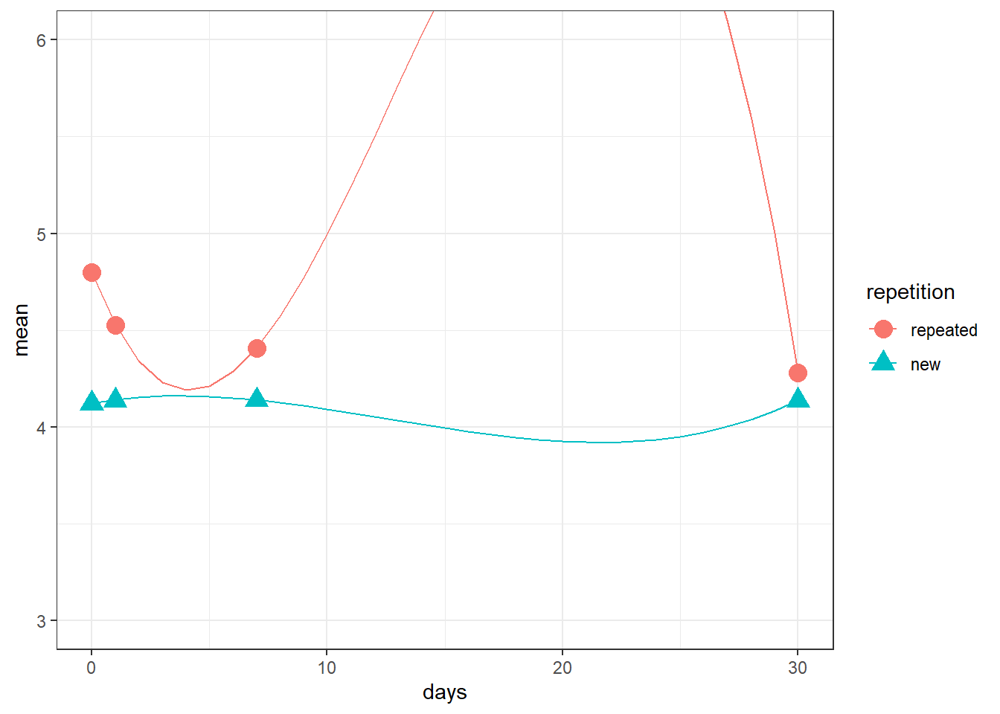
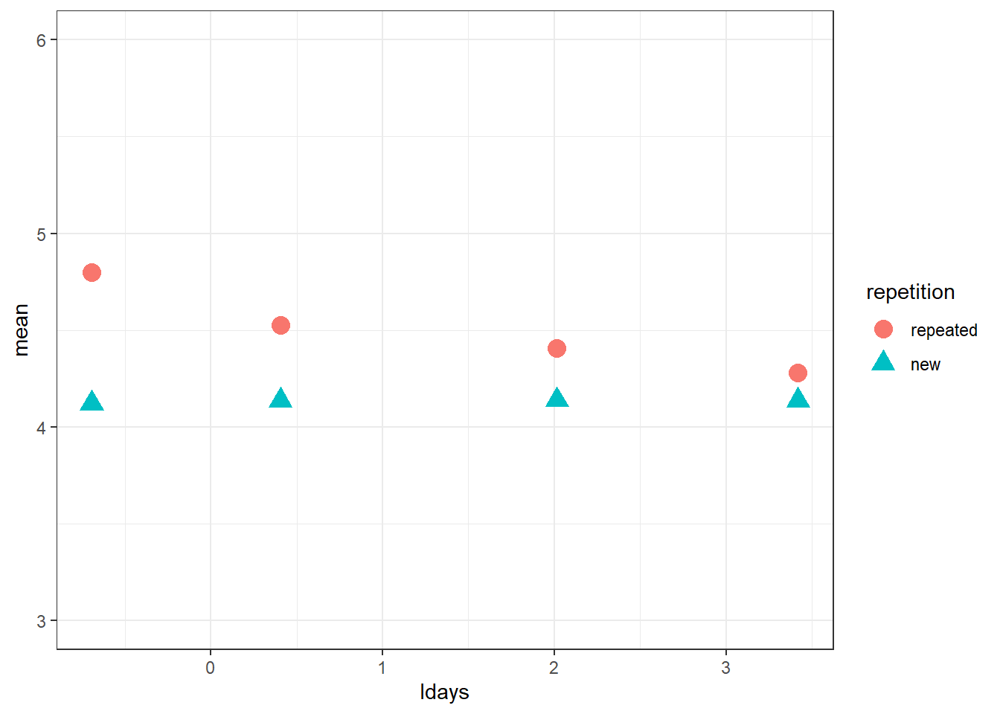

# Longitudinal analysis of multilevel data

## Truth-trajectory data


For the current exercise, we will be working with data from [Henderson, Simons, and Barr (2020)](http://doi.org/10.5334/joc.161), "The Trajectory of Truth: A Longitudinal Study of the Illusory Truth Effect."

The Illusory Truth phenomenon is the tendency of people to consider statements they have heard before as more likely to be true relative to novel statements [(Hasher, Goldstein, & Toppino, 1977)](https://doi.org/10.1016/S0022-5371(77)80012-1). Henderson et al. (2021) examined the persistence of this effect across four time intervals: immediately, one day, one week, and one month following exposure. Five hundred and sixty seven participants were exposed to 64 out of 128 possible statements of ambiguous veracity during an exposure phase, where they had to categorize the statements (science, language, politics, etc.) without judging their truth. In a later rating phase, they rated the full set of statements on a scale from 1 (definitely false) to 7 (definitely true). (Each repeated statement was repeated only once, at one of the four intervals.) Two examples of (actually false) statements used in the study are given below.

> The natural red dye in the shells of crustaceans is called xanthophyll.

> The fourth man on the moon was Charles P. Conrad.

In Henderson et al., to take into account the ordinal nature of the dependent variable, they fit an cumulative-link mixed-effects model with crossed random effects for participants and stimuli, using the `ordinal::clmm()` function. We are going to keep things much simpler, ignoring stimulus effects and working with the subject means. (If you want to learn more about what was done, please read the original paper and install the accompanying R package `truthiness` from [the github repository](https://github.com/dalejbarr/truthiness) using `remotes::install_github("dalejbarr/truthiness")`.`)

But we're also going to try to do something Henderson et al. didn't do, which is to formulate a growth-curve model so that we have a single function to express the predicted size of the illusory truth effect as a function of the number of days elapsed since the original exposure.

The binary R file [`truth-ratings.rds`](data/truth-ratings.rds){target="_download"} has mean truth ratings for each participant in each condition (repeated, new) at each time point from the study. Because we have (up to) 8 mean ratings for each participant, one for each condition (repeated, new) and at each time point (immediate, 1 day, 1 week, and 1 month) these data are multilevel.

Download the file and initialize your R session using the code below.


```r
library("lme4")
library("polypoly")
library("tidyverse")

tratings <- readRDS("truth-ratings.rds")
```


The first thing we should do is look at the data and make sure we understand what all the columns mean.


```r
tratings
```

```
## # A tibble: 4,300 × 5
##    ID    repetition interval  mean_rating  days
##    <chr> <fct>      <fct>           <dbl> <int>
##  1 S0001 repeated   immediate        4.62     0
##  2 S0001 repeated   1 day            4.69     1
##  3 S0001 repeated   1 week           4.62     7
##  4 S0001 repeated   1 month          4.69    30
##  5 S0001 new        immediate        4.06     0
##  6 S0001 new        1 day            3.94     1
##  7 S0001 new        1 week           4        7
##  8 S0001 new        1 month          3.62    30
##  9 S0002 repeated   immediate        4.06     0
## 10 S0002 repeated   1 day            4.06     1
## # ℹ 4,290 more rows
```

::: {.try}

Calculate overall means for each condition (`repetition`) at each measurement point (`days`), and then plot them. Your plot should look like the one below


<div class='webex-solution'><button>Solution</button>


```r
tr_means <- tratings %>% 
  group_by(repetition, days) %>% 
  summarize(mean = mean(mean_rating),
            .groups = "drop")

tr_means
```

```
## # A tibble: 8 × 3
##   repetition  days  mean
##   <fct>      <int> <dbl>
## 1 repeated       0  4.80
## 2 repeated       1  4.53
## 3 repeated       7  4.41
## 4 repeated      30  4.28
## 5 new            0  4.12
## 6 new            1  4.14
## 7 new            7  4.14
## 8 new           30  4.14
```


```r
# we'll store the plot as a variable so we can add stuff
# to it later
plot_main <- ggplot(tr_means,
       aes(days, mean, color = repetition)) +
  geom_point(aes(shape = repetition), size = 4) +
  coord_cartesian(ylim = c(3, 6))

plot_main
```


</div>


:::

That looks like a pattern that will be difficult to fit using polynomials. But let's try anyway, because it will fail, but demonstrate an important lesson. 

But before we start, we might as well do something we'll need to do later anyway, which is to create a numerical predictor for our condition variable, `repetition`.

:::{.try}

Create a new data frame `tratings2` which contains a deviation coded variable named `rep` for `repetition`, with "repeated" as 1/2 and "new" as -1/2.


<div class='webex-solution'><button>Solution</button>

```r
tratings2 <- tratings %>% 
  mutate(rep = if_else(repetition == "repeated", 1/2, -1/2))

# don't forget to double check!
tratings2 %>% 
  distinct(repetition, rep)
```

```
## # A tibble: 2 × 2
##   repetition   rep
##   <fct>      <dbl>
## 1 repeated     0.5
## 2 new         -0.5
```


</div>

:::

### Orthogonal polynomial model with `days`

We will use a cubic model. There are only 4 points in each condition, so this will fit the data perfectly, but also risks overfitting.

Now, we only have observations on days 0, 1, 7, and 30 for each participant, but we're going to want to plot a smooth function from 0 to 30 days, as if we made observations on every day. When we use the `poly_add_columns()` function from `polypoly`, the specific values of the polynomial predictors for these days will be different if the input is the sequence of integers 0 to 30 versus if the input is just the vector of 4 values (0, 1, 7, 30). So, what we'll need to do is generate predictor values for the full 31 days we want to plot, and then use an `inner_join()` to copy over the polynomial predictors for the four specific values of `days` in `tratings2`; i.e., 0, 1, 7, 30. 


```r
alldays <- tibble(days = 0:30) %>% 
  poly_add_columns(days, degree = 3, prefix = "d")

tratings3 <- tratings2 %>% 
  inner_join(alldays, "days")

# take a peek to make sure it makes sense
tratings3 %>%
  select(-interval)
```

```
## # A tibble: 4,300 × 8
##    ID    repetition mean_rating  days   rep     d1      d2     d3
##    <chr> <fct>            <dbl> <int> <dbl>  <dbl>   <dbl>  <dbl>
##  1 S0001 repeated          4.62     0   0.5 -0.301  0.365  -0.391
##  2 S0001 repeated          4.69     1   0.5 -0.281  0.292  -0.235
##  3 S0001 repeated          4.62     7   0.5 -0.161 -0.0402  0.205
##  4 S0001 repeated          4.69    30   0.5  0.301  0.365   0.391
##  5 S0001 new               4.06     0  -0.5 -0.301  0.365  -0.391
##  6 S0001 new               3.94     1  -0.5 -0.281  0.292  -0.235
##  7 S0001 new               4        7  -0.5 -0.161 -0.0402  0.205
##  8 S0001 new               3.62    30  -0.5  0.301  0.365   0.391
##  9 S0002 repeated          4.06     0   0.5 -0.301  0.365  -0.391
## 10 S0002 repeated          4.06     1   0.5 -0.281  0.292  -0.235
## # ℹ 4,290 more rows
```

Great. Now we are ready to fit the model. 

::: {.try}

Fit a model using `lme4::lmer()` with `mean_rating` as your response variable and the polynomial variables and `rep` as your predictors. Your model should include a by-subject random intercept and by-subject random slope for `rep`.


<div class='webex-solution'><button>Solution</button>

```r
mod_poly <- lmer(mean_rating ~ (d1 + d2 + d3) * rep +
  (1 + rep | ID), data = tratings3)

print(summary(mod_poly), corr = FALSE)
```

```
## Linear mixed model fit by REML ['lmerMod']
## Formula: mean_rating ~ (d1 + d2 + d3) * rep + (1 + rep | ID)
##    Data: tratings3
## 
## REML criterion at convergence: 6100.7
## 
## Scaled residuals: 
##     Min      1Q  Median      3Q     Max 
## -4.5632 -0.5543  0.0034  0.5391  3.5432 
## 
## Random effects:
##  Groups   Name        Variance Std.Dev. Corr
##  ID       (Intercept) 0.11745  0.3427       
##           rep         0.05626  0.2372   0.55
##  Residual             0.18207  0.4267       
## Number of obs: 4300, groups:  ID, 567
## 
## Fixed effects:
##             Estimate Std. Error t value
## (Intercept)   4.8513     0.1143  42.459
## d1            1.7820     0.3804   4.685
## d2           -1.4132     0.3011  -4.693
## d3           -1.6908     0.3023  -5.593
## rep           1.6170     0.2264   7.143
## d1:rep        4.2144     0.7582   5.558
## d2:rep       -3.3049     0.6004  -5.504
## d3:rep       -3.9193     0.6024  -6.506
```


</div>

:::

OK, but is it doing what we want? We should plot the polynomial function against our predicted values.


```r
# create a new data set with all relevant values of the predictors
dat_pred <- tratings3 %>% 
  distinct(repetition, rep) %>% 
  crossing(alldays) %>% 
  mutate(mean = predict(mod_poly, newdata = .,
                               re.form = ~0))
```

OK, let's add the predictions to our plot.


```r
plot_main +
  geom_line(data = dat_pred)
```



Whoa! Clearly, the model is bad. We have overfitted the data and ended up with something nonsensical. We need a better model.

### Orthogonal polynomial with `log(days)`

One of the things that made modeling challenging was the irregular spacing of the measurements (0, 1, 7, and 30 days).  We can do is transform the `days` variable into something more equally spaced using the `log()` function, and perhaps this will make it easier to fit a cubic function. But there is a slight problem: the `log()` of zero is negative infinity. So we'll cheat a tiny bit and add .5 to `days` before taking the log.

Above, we created `tr_means` which had the overall means for each day and condition. Let's add in the log of (days + .5) and plot that to see where it gets us.


```r
tr_means2 <- tr_means %>% 
  mutate(ldays = log(days + .5))

# save in variable `plot_log` so we can add predicted values
plot_log <- ggplot(tr_means2,
       aes(ldays, mean, color = repetition)) +
  geom_point(aes(shape = repetition), size = 4) +
  coord_cartesian(ylim = c(3, 6))

plot_log
```



That looks like it might be easier to deal with. Let's repeat what we just did, but using `ldays` to create our polynomial predictors.


```r
alldays <- tibble(days = 0:30,
                  ldays = log(days + .5)) %>% 
  poly_add_columns(ldays, degree = 3, prefix = "d")

tratings4 <- tratings2 %>% 
  inner_join(alldays, "days")

mod_polylog <- lmer(
  mean_rating ~ (d1 + d2 + d3) * rep +
    (1 + rep | ID), data = tratings4)

print(summary(mod_polylog), corr = FALSE)
```

```
## Linear mixed model fit by REML ['lmerMod']
## Formula: mean_rating ~ (d1 + d2 + d3) * rep + (1 + rep | ID)
##    Data: tratings4
## 
## REML criterion at convergence: 6113.4
## 
## Scaled residuals: 
##     Min      1Q  Median      3Q     Max 
## -4.5632 -0.5543  0.0034  0.5391  3.5432 
## 
## Random effects:
##  Groups   Name        Variance Std.Dev. Corr
##  ID       (Intercept) 0.11745  0.3427       
##           rep         0.05626  0.2372   0.55
##  Residual             0.18207  0.4267       
## Number of obs: 4300, groups:  ID, 567
## 
## Fixed effects:
##             Estimate Std. Error t value
## (Intercept)  4.26018    0.01739 244.935
## d1          -0.24896    0.02708  -9.194
## d2           0.04817    0.02693   1.789
## d3          -0.05437    0.02503  -2.172
## rep          0.24411    0.02158  11.311
## d1:rep      -0.50126    0.05391  -9.297
## d2:rep       0.12910    0.05372   2.403
## d3:rep      -0.12770    0.04999  -2.555
```

Now we once again create a data frame with data to use with the `predict` function.


```r
dat_pred_log <- tratings4 %>% 
  distinct(repetition, rep) %>% 
  crossing(alldays) %>% 
  mutate(mean = predict(mod_polylog, newdata = .,
                               re.form = ~0))
```

Now let's plot it against our data on the log scale.


```r
plot_log +
  geom_line(data = dat_pred_log)
```


Nice! How does it look when we plot it against our data on the original scale?


```r
plot_main +
  geom_line(data = dat_pred_log)
```


Also good!

### Back to the math

Now that we have a model we are happy with (`mod_polylog`), we can mathematically express how the illusory truth effect evolves as a function of days since first exposure.

In particular, the predicted mean rating for condition $c$ on day $d$ is given by the formula

$$Y_{cd} = \beta_0 + \beta_1 D_{1d} + \beta_2 D_{2d} + \beta_3 D_{3d} + \beta_4 X_c + \beta_5 D_{1d} X_c + \beta_6 D_{2d} X_c + \beta_7 D_{3d} X_c$$

where $D_{1d}$, $D_{2d}$, $D_{3d}$ are the values of the three polynomial predictors at log(day $d$ + .5) and $X_c$ is our deviation coded predictor for condition (repeated = 1/2, new = -1/2).

Plugging in the values from the model gives us:


$$Y_{cd} = 4.260 + -0.249 D_{1d} + 0.048 D_{2d} + -0.054 D_{3d} + 0.244 X_c + -0.501 D_{1d} X_c + 0.129 D_{2d} X_c + -0.128 D_{3d} X_c$$
